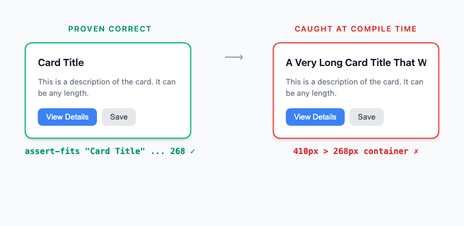
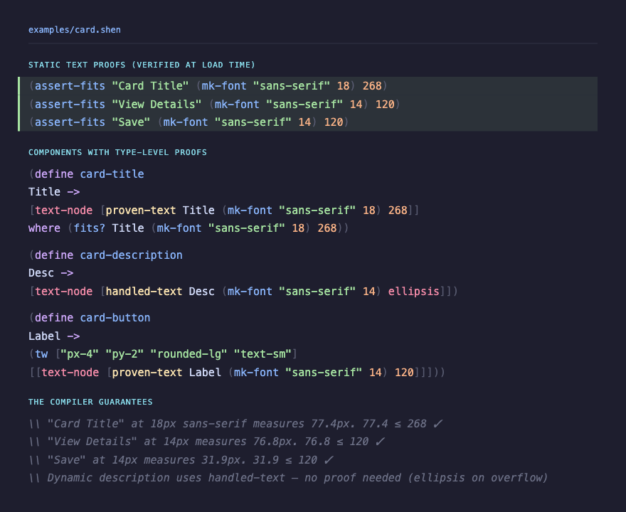
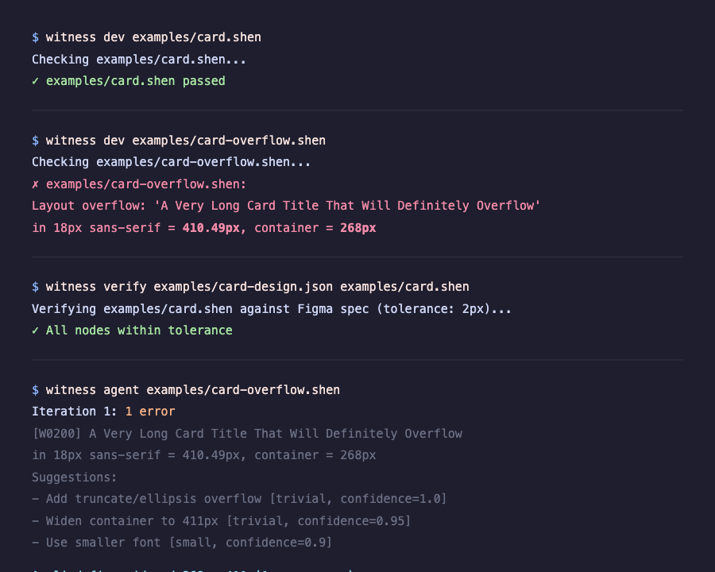

# Witness: Layout Overflow is a Compile-Time Error

Witness is a Shen extension that makes layout correctness provable at compile time. Text that overflows its container? That's not a bug you find in QA. It's a type error the compiler rejects before your code ever runs.

## The Problem

Every UI team has shipped text that overflows its container. A button label that's fine in English but breaks in German. A card title that a PM changes from "Settings" to "Account & Notification Settings" and nobody notices the truncation until production.

These bugs are invisible to unit tests, linters, and type systems. They require a human eyeball on every screen, in every language, at every breakpoint. And humans miss things.



The card on the left is **proven correct** -- the compiler verified that "Card Title" fits in 268px at 18px sans-serif. The card on the right is **rejected at compile time** -- 410px of text in a 268px container. The code never runs.

## How It Works

Witness connects three existing tools in a way nobody has before:

- **Shen** -- a language with a type system based on sequent calculus that can evaluate arbitrary functions as side conditions
- **Textura** -- Yoga (React Native's layout engine) + Pretext (text measurement), running as pure math without a DOM
- **ShenScript** -- runs Shen on JavaScript, 60KB, 50ms startup

The key insight: Textura computes layout as pure functions. Shen's type system can call pure functions. Therefore, **layout constraints can be type-checked**.

### The Source Code



Three things happen in this code:

1. **`assert-fits`** calls run at file load time. They measure the text with Pretext and error immediately if it overflows. This is the compile-time gate.

2. **`proven-text`** is a type that requires a `where (fits? ...)` guard. The type checker won't let you construct a `proven-text` value without proving the text fits. You literally cannot put unproven text into a container.

3. **`handled-text`** is the escape hatch for dynamic content. You explicitly choose an overflow strategy (ellipsis, clip, visible). The compiler accepts this because you've acknowledged the overflow risk.

The result: every text node in your layout is either **proven to fit** or **explicitly handled**. Nothing slips through.

## The Demo

### Step 1: Proofs pass

```
$ witness dev examples/card.shen
Checking examples/card.shen...
  ✓ examples/card.shen passed
```

The card has three static text proofs. "Card Title" (77px) fits in 268px. "View Details" (77px) and "Save" (32px) both fit in 120px. All verified by measuring with Pretext at load time.

### Step 2: Overflow caught

```
$ witness dev examples/card-overflow.shen
Checking examples/card-overflow.shen...
  ✗ examples/card-overflow.shen:
    Layout overflow: 'A Very Long Card Title That Will Definitely Overflow'
    in 18px sans-serif = 410.49px, container = 268px
```

Change the title and the compiler catches it instantly. Not at runtime. Not in a screenshot test. At load time, with the exact pixel measurements.

### Step 3: Figma verification

```
$ witness verify examples/card-design.json examples/card.shen
Verifying examples/card.shen against Figma spec (tolerance: 2px)...
  ✓ All nodes within tolerance
```

Export your Figma design as JSON. Witness computes the layout from your code and diffs the two position trees. If your code drifts from the design by more than the tolerance, you know.

### Step 4: Agent auto-fix

```
$ witness agent examples/card-overflow.shen
Iteration 1: 1 error
  [W0200] A Very Long Card Title That Will Definitely Overflow
  Suggestions:
    - Add truncate/ellipsis overflow  [trivial, confidence=1.0]
    - Widen container to 411px        [trivial, confidence=0.95]
    - Use smaller font                [small,   confidence=0.9]

  Applied fix: widened 268 -> 411 (1 occurrence)
Done in 2 iterations
```

The agent parses the structured error, picks the best fix, rewrites the source file, and re-checks. Two iterations, zero human intervention.



## What Ships to Production

Nothing proof-related. Proofs are erased after compilation, like TypeScript types after `tsc`. What ships is plain JavaScript calling Textura for layout and the DOM for rendering. The proof machinery has zero runtime cost.

The only proof-related code that survives into production is explicit `fits?` runtime checks the developer chose to write for dynamic content -- and those are just if-statements.

## The Stack

```
Shen kernel            -- types, Prolog, sequent calculus
ShenScript             -- runs Shen on JS, 60KB
Textura                -- Pretext + Yoga WASM: layout as pure math
node-canvas            -- text measurement without a browser
────────────────────────────────────────────────────
Witness (~700 lines)   -- connects them all
```

Everything above the line exists and works. Witness is ~700 lines of Shen and ~150 lines of JavaScript glue.

## Try It

```bash
git clone https://github.com/pyrex41/witness
cd witness && npm install

# Run the proofs
node cli/check.js dev examples/card.shen

# See it catch overflow
node cli/check.js dev examples/card-overflow.shen

# Render to HTML
node cli/check.js render examples/card.shen --expr "(render-view)" --output card.html

# Verify against Figma
node cli/verify.js examples/card-design.json examples/card.shen

# Auto-fix overflow
cp examples/card-overflow.shen /tmp/fix-me.shen
node cli/agent.js /tmp/fix-me.shen
```
